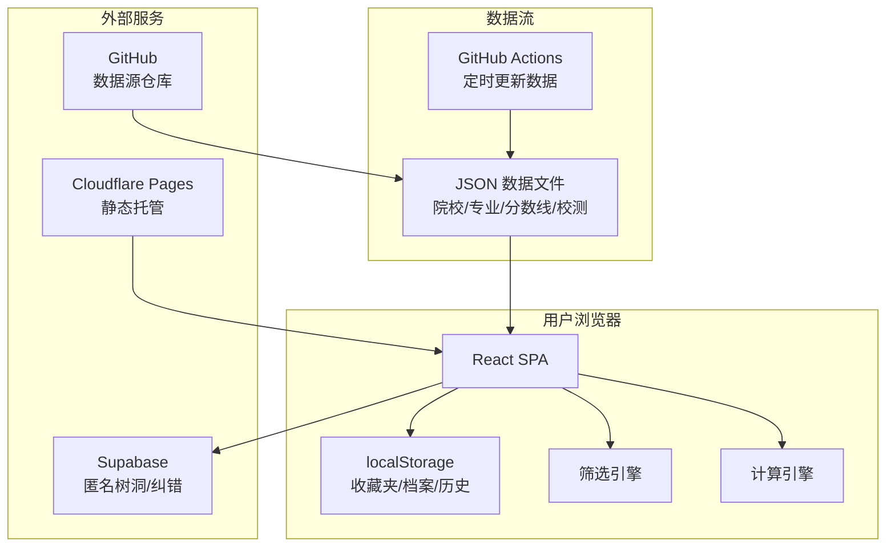

## 产品概述

浙江三位一体辅助系统是一个面向浙江高中生的免费教育工具网站，帮助考生理解、筛选、计算和决策三位一体招生路径。系统以纯静态站点运行，数据预置在 JSON 文件中，用户无任何注册门槛即可使用全部功能。

## MVP 核心功能（第一组 + 第二组全部）

### 入口与筛选

- **首页简介**：简洁介绍三位一体是什么、适合谁、基本流程
- **双筛选模式**：①选科筛选（勾选物理/化学/生物等科目，实时过滤专业）；②报考条件筛选（按学考等级要求过滤院校）
- **冲稳保分层**：根据学考成绩自动将院校分为冲刺/稳妥/保底三档，并明确标注"提前批第一志愿只能选一所"的规则提醒
- **院校模糊搜索**：输入"杭电"→"杭州电子科技大学"、"浙财"→"浙江财经大学"

### 计算工具

- **综合分计算器**：输入学考等级、校测预估分、高考预估分，选择目标院校后自动按该校公式计算综合分
- **反向条件推算器**：选定目标院校 → 输入已有学考等级和未考科目假设 → 推算高考和校测分别需要多少分才能录取

### 院校数据展示

- **基本信息卡**：校区/办学地点、学费标准（标注中外合作等特殊费用）、体检限制（色盲色弱等）、招生办电话/咨询群
- **校测内容**：各校综合素质测试考什么、题型、是否有笔试/面试/体测、面试形式
- **报名流程与材料**：按院校展示报名步骤、截止时间和所需准备材料清单
- **历年竞争比**：报名人数/初审入围人数/最终录取人数
- **一分一段表**：历年录取分数段位数据
- **专业毕业去向与满意度**：引用阳光高考网实名投票数据，统一量化展示综合满意度、环境满意度、生活满意度
- **住宿条件**：整合社交媒体信息，展示各校宿舍情况
- **转专业限制标注**：醒目标注三一录取后是否有转专业限制及其具体规则

### 个人工具

- **收藏夹**（localStorage）：保存感兴趣的院校和专业
- **多院校并排对比**：最多5所院校横向对比，优势标黄、劣势标红，以最左院校为参考线
- **报名材料清单生成器**：根据收藏院校自动汇总所需材料
- **「我的三一档案」整合页**：收藏院校 + 折算历史 + 时间线节点 + 材料清单，可截图分享
- **方案导出**：支持导出为 Markdown 或 Excel

### 数据可信度

- 每个可视化数据区块附来源链接供核实

## 技术栈

| 层面 | 技术选择 | 说明 |
| --- | --- | --- |
| 前端框架 | React 19 + Vite 6 | 构建产物为纯静态文件，零服务端成本 |
| 类型系统 | TypeScript 5 | 全量类型覆盖，数据字段有据可查 |
| UI 组件 | shadcn/ui + Tailwind CSS 4 | 免费开源，组件质量高，原子化样式 |
| 路由 | React Router v7 | SPA 客户端路由 |
| 状态管理 | Zustand | 轻量全局状态，管理筛选条件和计算结果 |
| 图表 | Recharts | 竞争比图表、一分一段表可视化 |
| 数据持久化 | localStorage | 收藏夹、档案、计算历史 |
| 数据层 | JSON 文件（构建时内联） | 院校、专业、分数线等静态数据 |
| 树洞/纠错 | Supabase（匿名登录） | 无需注册，打开即用 |
| 部署 | Cloudflare Pages | 免费无限带宽，全球 CDN |
| 数据更新 | GitHub Actions（定时任务） | 定期更新 JSON 数据并触发重新部署 |


## 架构设计

### 整体架构



### 数据流

1. **静态数据流**：JSON 文件 → Vite 构建时内联 → React 组件渲染
2. **计算流**：用户输入学考/高考/校测分 → 挂载该校公式 → 实时计算综合分 → 冲稳保分层
3. **存储流**：用户操作（收藏/历史）→ Zustand → localStorage 持久化
4. **社区流**：树洞发言 → Supabase 匿名客户端 → Supabase 数据库 → 实时同步回页面

### 路由设计

| 路由 | 页面 | 功能 |
| --- | --- | --- |
| `/` | 首页 | 三位一体简介、快速入口、访客计数 |
| `/schools` | 院校列表 | 双筛选、冲稳保标签、模糊搜索、院校卡片列表 |
| `/schools/:id` | 院校详情 | 基本信息卡、校测内容、报名流程、竞争比、满意度、住宿、转专业限制 |
| `/calculator` | 综合分计算器 | 正算 + 反向推算，院校公式自动匹配 |
| `/compare` | 院校对比 | 多校并排对比，差异可视化 |
| `/favorites` | 我的收藏 | 收藏的院校/专业管理 |
| `/profile` | 我的三一档案 | 整合页（收藏+计算历史+时间线+材料清单） |
| `/faq` | 常见问题 | 三位一体科普问答折叠面板 |
| `/treehole` | 树洞 | 匿名讨论区（Supabase 驱动） |


## 实现方案

### 双筛选引擎

**策略**：Zustand store 维护筛选状态（selectedSubjects、minScore、targetTier），筛选用纯函数实现，结果通过 useMemo 缓存，避免重复计算。

- 选科筛选：遍历专业列表，检查 `requiredSubjects` 字段是否被当前勾选科目覆盖
- 学考条件筛选：检查学考 A/B 数量是否满足院校门槛
- 冲稳保分层：基于学考折算分与院校往年录取分的差值区间判定，差值 > 5% → 冲，±5% → 稳，< -5% → 保

### 综合分计算器

**核心挑战**：39 所院校各有不同公式（权重不同、折算标准不同、满分不同）。

**方案**：每所院校在 JSON 中内嵌 `formula` 对象，描述学考/A 计分/B 计分/权重比例。计算引擎读取公式元数据，动态执行。这样做的好处是新院校加入只需补充 JSON，无需改代码。

```
formula: {
  xuekao: { A: 15, B: 10, C: 6, D: 1, fullScore: 150 },
  xiaokao: { fullScore: 100 },
  gaokao: { fullScore: 750 },
  weights: { xuekao: 0.15, xiaokao: 0.25, gaokao: 0.60 }
}
```

反向推算用二分查找：给定目标综合分，遍历可能的校测分/高考分组合，找到满足条件的最小值。

### 院校对比

以最左院校为基准线，差异数据标注：

- 优势项（如更低的学费、更高的满意度）：黄色背景 + ⊕ 图标
- 劣势项（如更高的分数要求、转专业受限）：红色背景 + ⊖ 图标

### localStorage 策略

- **收藏夹**：`favorites: string[]`（学校 ID 数组）
- **计算历史**：`calcHistory: CalcRecord[]`（最近 20 条，含输入和结果）
- **档案数据**：`profile: { nickname?, targetSchools, deadlines[], materials[] }`
- **容量管理**：总容量限制 ~5MB，超出时提示清理

### Supabase 树洞

- 使用 Supabase JS SDK 的 `signInAnonymously()`，用户打开页面自动获得匿名身份
- 树洞数据表：`{ id, content, created_at, anonymous_id }`
- 纠错提交表：`{ id, school_id, field, description, status }`
- 不做敏感词过滤（MVP 阶段），仅做基本非法字符过滤

### 性能考量

- 院校列表使用虚拟滚动（react-virtuoso），39 所院校一次渲染无性能问题，但为将来扩展保留
- JSON 数据文件按需拆分（schools.json、majors.json 等），Vite 构建时 Tree-shaking
- 图表组件懒加载（React.lazy），首屏不加载 Recharts
- 综合分计算用 Web Worker 避免主线程阻塞（可选，二期优化）

## 目录结构

```
三位一体辅助系统/
├── public/
│   ├── favicon.svg
│   └── og-image.png                 # 社交分享预览图
├── src/
│   ├── components/
│   │   ├── ui/                      # [NEW] shadcn/ui 组件（自动生成）
│   │   │   ├── button.tsx
│   │   │   ├── card.tsx
│   │   │   ├── badge.tsx
│   │   │   ├── accordion.tsx
│   │   │   ├── dialog.tsx
│   │   │   ├── select.tsx
│   │   │   ├── checkbox.tsx
│   │   │   ├── slider.tsx
│   │   │   ├── tooltip.tsx
│   │   │   └── ...
│   │   ├── layout/
│   │   │   ├── Header.tsx           # [NEW] 顶部导航栏，含 Logo、导航链接、移动端汉堡菜单
│   │   │   ├── Footer.tsx           # [NEW] 页脚，含数据来源声明、GitHub 链接、访客计数
│   │   │   ├── MobileNav.tsx        # [NEW] 底部固定导航栏（移动端）
│   │   │   └── Layout.tsx           # [NEW] 全局布局容器
│   │   ├── school/
│   │   │   ├── SchoolCard.tsx       # [NEW] 院校卡片组件，缩略信息 + 冲稳保标签
│   │   │   ├── SchoolFilter.tsx     # [NEW] 双筛选面板，选科勾选 + 学考条件输入
│   │   │   ├── SchoolSearch.tsx     # [NEW] 模糊搜索输入框，带别名匹配
│   │   │   ├── SchoolInfoCard.tsx   # [NEW] 详情页基本信息卡
│   │   │   ├── SchoolExamFormat.tsx # [NEW] 校测内容展示组件
│   │   │   ├── SchoolProcess.tsx    # [NEW] 报名流程时间线组件
│   │   │   ├── CompetitionChart.tsx # [NEW] 历年竞争比图表（Recharts）
│   │   │   ├── SatisfactionCard.tsx # [NEW] 满意度三维雷达图组件
│   │   │   ├── TransferWarning.tsx  # [NEW] 转专业限制警告标注组件
│   │   │   └── ScoreSegment.tsx     # [NEW] 一分一段表组件
│   │   ├── calculator/
│   │   │   ├── ScoreCalculator.tsx  # [NEW] 综合分计算器主组件（正算模式）
│   │   │   ├── ReverseCalculator.tsx # [NEW] 反向条件推算器
│   │   │   ├── FormulaDisplay.tsx   # [NEW] 显示当前院校计算公式
│   │   │   └── CalculatorHistory.tsx # [NEW] 计算历史记录列表
│   │   ├── compare/
│   │   │   ├── CompareTable.tsx     # [NEW] 多校对比表格，差异高亮
│   │   │   └── CompareSelector.tsx  # [NEW] 对比院校选择器
│   │   ├── profile/
│   │   │   ├── MaterialChecklist.tsx # [NEW] 报名材料清单生成器
│   │   │   ├── TimelineView.tsx     # [NEW] 三一时间线视图
│   │   │   └── ProfileExport.tsx    # [NEW] 导出按钮（Markdown/Excel）
│   │   └── treehole/
│   │       ├── TreeholeFeed.tsx     # [NEW] 树洞留言列表
│   │       ├── TreeholePost.tsx     # [NEW] 树洞发帖表单
│   │       └── DataCorrection.tsx   # [NEW] 数据纠错提交入口
│   ├── pages/
│   │   ├── HomePage.tsx             # [NEW] 首页：简介、快速入口卡片、引导流程
│   │   ├── SchoolListPage.tsx       # [NEW] 院校列表页：筛选 + 搜索 + 卡片网格
│   │   ├── SchoolDetailPage.tsx     # [NEW] 院校详情页：全部第二组信息
│   │   ├── CalculatorPage.tsx       # [NEW] 计算器页：正算 + 反算切换
│   │   ├── ComparePage.tsx          # [NEW] 对比页：多校并排
│   │   ├── FavoritesPage.tsx        # [NEW] 收藏页：已收藏院校管理
│   │   ├── ProfilePage.tsx          # [NEW] 档案页：整合视图 + 导出
│   │   ├── FAQPage.tsx              # [NEW] FAQ 页：折叠面板问答
│   │   └── TreeholePage.tsx         # [NEW] 树洞页：匿名讨论区
│   ├── data/
│   │   ├── schools.json             # [NEW] 院校核心数据：名称、别名、校区、联系方式、学费、体检限制
│   │   ├── majors.json              # [NEW] 专业数据：专业名、选科要求、所属院校、三一招生计划数
│   │   ├── admission.json           # [NEW] 录取数据：历年分数线、学考门槛、竞争比、综合分最低分
│   │   ├── exam-formats.json        # [NEW] 校测数据：笔试/面试/体测、题型、流程、注意事项
│   │   ├── score-segments.json      # [NEW] 一分一段表：分数段位映射
│   │   ├── satisfaction.json        # [NEW] 满意度数据：综合/环境/生活三维评分
│   │   ├── dormitory.json           # [NEW] 住宿数据：条件描述、评分、信息来源
│   │   ├── transfer-rules.json      # [NEW] 转专业规则：是否受限、具体限制描述
│   │   └── application-process.json # [NEW] 报名流程：步骤、截止时间、所需材料列表
│   ├── lib/
│   │   ├── calculator.ts            # [NEW] 计算引擎：学考折算、综合分计算、反向推算
│   │   ├── filter.ts                # [NEW] 筛选逻辑：选科匹配、条件过滤、冲稳保判定
│   │   ├── search.ts                # [NEW] 模糊搜索：别名匹配、拼音首字母
│   │   ├── storage.ts               # [NEW] localStorage 封装：收藏、历史、档案读写
│   │   ├── supabase.ts              # [NEW] Supabase 客户端初始化与匿名登录
│   │   ├── export.ts                # [NEW] 导出工具：Markdown 生成、Excel 生成
│   │   └── constants.ts             # [NEW] 常量：科目列表、分层阈值、默认配置
│   ├── hooks/
│   │   ├── useFavorites.ts          # [NEW] 收藏夹 Hook（状态 + 增删查）
│   │   ├── useFilter.ts             # [NEW] 筛选 Hook（状态 + 结果计算）
│   │   ├── useCalculator.ts         # [NEW] 计算器 Hook（输入管理 + 实时计算）
│   │   ├── useCompare.ts            # [NEW] 对比 Hook（添加/移除/差异计算）
│   │   └── useTreehole.ts           # [NEW] 树洞 Hook（列表加载、发帖、实时订阅）
│   ├── types/
│   │   └── index.ts                 # [NEW] 全局类型定义：School, Major, AdmissionData, ExamFormat, CalcResult 等
│   ├── stores/
│   │   ├── filterStore.ts           # [NEW] Zustand store：筛选状态
│   │   └── calcStore.ts             # [NEW] Zustand store：计算器状态与历史
│   ├── App.tsx                       # [NEW] 根组件：路由配置 + 全局 Layout
│   ├── main.tsx                      # [NEW] 入口文件
│   └── index.css                     # [NEW] 全局样式 + Tailwind 指令
├── scripts/
│   └── update-data.ts               # [NEW] 数据更新脚本（GitHub Actions 调用）
├── .github/
│   └── workflows/
│       └── update-data.yml          # [NEW] GitHub Actions：定时更新数据并触发部署
├── index.html
├── package.json
├── tsconfig.json
├── tailwind.config.ts
├── vite.config.ts
├── components.json                   # shadcn/ui 配置文件
└── README.md
```

## 关键类型定义

```typescript
// 院校核心数据
interface School {
  id: string;
  name: string;           // 全称：杭州电子科技大学
  shortName: string;      // 简称：杭电
  aliases: string[];      // 别名：["杭电", "HDU"]
  type: 'provincial' | 'ministry';
  tier: 'A' | 'B' | 'C'; // 冲稳保分层（由筛选引擎动态计算，此处预置参考）
  
  info: {
    campuses: { name: string; address: string }[];
    website: string;
    admissionsPhone: string;
    consultQQ?: string;
    tuitionGeneral: string;        // 普通专业学费
    tuitionSinoForeign?: string;   // 中外合作学费
    healthRestrictions?: string;   // 体检限制
  };
  
  examFormat: {
    hasWrittenTest: boolean;
    hasInterview: boolean;
    hasPhysicalTest: boolean;
    writtenTestSubjects?: string[];
    interviewFormat?: 'individual' | 'group' | 'both';
    contentSummary: string;
    tips: string;
  };
  
  transferRestriction: {
    restricted: boolean;
    detail: string;        // 具体限制描述
  };
}

// 综合分计算公式元数据
interface FormulaMeta {
  xuekao: {
    A: number; B: number; C: number; D: number;
    fullScore: number;     // 折算后满分（100 或 150）
  };
  xiaokao: { fullScore: number };
  gaokao: { fullScore: number };
  weights: {
    xuekao: number;       // 0.15
    xiaokao: number;      // 0.25
    gaokao: number;       // 0.60
  };
}

// 计算器输入
interface CalcInput {
  schoolId: string;
  xuekaoGrades: { subject: string; grade: 'A'|'B'|'C'|'D'|'E' }[];
  xiaokaoScore: number | null;
  gaokaoScore: number | null;
}

// 计算结果
interface CalcResult {
  xuekaoConverted: number;
  xiaokaoNormalized: number;
  gaokaoNormalized: number;
  comprehensiveScore: number;
  tier: 'reach' | 'match' | 'safety'; // 冲稳保
}
```

## 设计风格

### 主题定位

面向高中生的教育工具，风格关键词：**清新、可信、温暖、现代**。
避免冷冰冰的数据堆砌，用柔和的视觉语言降低考生焦虑感，同时保持信息层级清晰、数据可读性强。

### 色彩体系

以蓝色为主色调传递信任感和学术气质，搭配暖色强调重点信息。整体采用高对比度、低饱和度的搭配，确保长时间浏览不疲劳。

### 布局策略

- **移动端优先**：高中生主要用手机访问，所有页面以 375px 宽度为基准设计，逐步增强至桌面端
- **卡片式信息架构**：院校信息、计算结果、数据对比均使用卡片承载，视觉分离清晰
- **固定底部导航**：移动端使用底部 Tab Bar（首页/院校/计算/档案），符合拇指操作热区

### 页面设计

#### 首页

- **顶部英雄区**：大标题"三位一体，不止一条路" + 副标题简述 + 渐变蓝色背景 + 柔和几何装饰
- **简介卡片**：三步走图解（学考→校测→高考），每步配图标和一句话说明
- **快速入口**：三个大按钮卡片——"我能报哪些学校？""算算我的综合分""院校数据查询"
- **访客计数**：底部轻量展示"你是第 N 位使用者"，给予参与感

#### 院校列表页

- **筛选面板**：顶部固定，包含科目勾选（横向chip）、学考条件滑块（A个数/B个数）、搜索框
- **冲稳保分段**：三段式布局，每段有对应的颜色标签（冲=蓝色、稳=绿色、保=灰色），折叠面板可选
- **院校卡片**：校名 + 简称 + 学考门槛标签 + 综合分参考 + 校测类型图标，点击进入详情

#### 院校详情页

- **顶部导航**：院校名称 + 返回按钮 + 收藏星标
- **信息分区**：使用 Tab 切换（概览/校测/数据/生活），或手风琴折叠面板
- **转专业警告**：如有限制，顶部显示醒目黄色警告横幅
- **来源链接**：每个数据区块底部附灰色小字来源链接

#### 计算器页

- **上下分屏**：上方输入区（学考等级选择器+滑块），下方结果区实时更新
- **公式展示**：当前院校公式以卡片内嵌展示，标注"该公式来源于 XX 大学 2025 年招生章程"
- **模式切换**：正算/反算通过 Segmented Control 切换
- **反向推算**：目标院校选择后，输入已有等级 → 滑块调节未考科目假设 → 显示所需高考/校测最低分

#### 我的三一档案页

- **时间线**：垂直时间线展示关键节点（报名截止、校测时间、录取公布等）
- **收藏院校区**：已收藏院校的紧凑列表
- **材料清单**：勾选框列表，已准备的打勾
- **导出按钮**：底部固定"生成截图"和"导出文件"两个操作按钮

### 动效与交互

- 卡片 hover 时轻微上浮 + 阴影加深（桌面端）
- 筛选条件变更时结果以淡入过渡
- 计算器结果数字使用计数动画
- 收藏按钮点击有心跳缩放动画
- 冲稳保标签使用微妙的渐变背景

## Agent Extensions

由于项目从零搭建且无需代码探索，本次不使用 Agent Extensions。后续如需数据爬取可启用浏览器自动化技能。