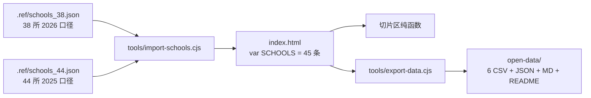

# 三位一体辅助系统 · 交接文档（转接.md）

> 生成时间：**2026-09-16**（本版为全量重写，反映当前代码与数据真实状态；旧版含大量历史留存，已按现状核对更新）
> **当前状态一句话**：数据与功能均已最新（**38 所三位一体口径 + 类别维度 + 下载中文化**），**本轮全部改动已于 2026-09-16 提交并推送（commit `9d40c5b`，`main` 已与远端同步，线上已重新部署）**。
> 远端 `main` 现指向 `9d40c5b`；数据管道资产（`.三位一体数据采集表.ref/` + `溯源素材/`）已纳入跟踪，`.codebuddy/`、`.workbuddy/`、`live-app/data/` 已忽略。

---

## 0. 五句话速览

1. **真实应用**在 `d:/Desktop/VibeCoding/三位一体辅助系统/live-app/`（React 单文件前端 + Node 本地服务 + Cloudflare Pages Functions），本地跑 8080，线上 `https://three-one-assistant.pages.dev` 已部署。
2. **GitHub 仓库** `lyhtakeashot/three-one-assistant` 跟踪的是**外层目录**（`live-app` 是子目录）；push 会自动触发 Cloudflare Pages 部署。
3. **磁盘存在两套代码**，只有 `live-app` 是当前维护版（见 §2），**改代码只改 live-app**。
4. **院校库当前 45 条** = 2026 招生 **38 所** + 2026 未招但 2025 招过的**备查 7 所**；「最新」视图只出 38 所。
5. **测试基线 `4585 passed / 0 failed`**（2026-09-17 起；此前为 4582，因西湖大学补学考 A/B/C/D 后转为「标准折算」触发 3 条额外断言），任何改动后必须保持 0 failed（见 §4.3 与附录 B）。

---

## 1. 关键位置

| 项目 | 路径 / 值 |
|---|---|
| 项目根（也是 git 根） | `d:/Desktop/VibeCoding/三位一体辅助系统/` |
| **真实应用（唯一维护版）** | `d:/Desktop/VibeCoding/三位一体辅助系统/live-app/` |
| 目标文档 | `三位一体辅助系统全目标.md` |
| 数据采集需求表 | `三位一体数据采集需求表.md` |
| **溯源采集需求表** | `三位一体数据溯源采集需求表.md`（每数据块挂来源链接的规范） |
| 数据资产（**未跟踪**） | `.三位一体数据采集表.ref/`（生成脚本 + 中间数据）、`溯源素材/`（38 份单校溯源 JSON）、`三位一体数据采集表.xlsx`（38 所）、`三位一体数据采集表-2025.xlsx`（44 所） |
| GitHub 远程 | `https://github.com/lyhtakeashot/three-one-assistant.git`（分支 main） |
| 线上网址 | `https://three-one-assistant.pages.dev` |
| 本地运行 | `cd live-app && node server.cjs` → http://localhost:8080 |
| 测试 | `node live-app/test/run-tests.cjs`（可 `node live-app/test/run-tests.cjs api` 只跑一组） |

---

## 2. ⚠️ 双副本警示（务必先读）

| 目录 | 是什么 | 维护? |
|---|---|---|
| `.../live-app/` | **真实应用**：单文件前端 `index.html` + `server.cjs` + `functions/` + PWA + `test/` + `open-data/` + `tools/` | ✅ 是，所有开发在这里 |
| `.../three-one-assistant/` | 旧 Vite + React TS 工程（`src/*.tsx`、`vite.config` 等） | ❌ 不再维护（保留未动，勿删） |
| `.../live-app/src/`、`app.html`、`data.js`、`components.js`、`pages.js`、`main.js`、`utils.js`、`style.css`、`vite.config.ts`、`package*.json`、`scripts/`、`public/`、`.github/` | 旧 Vite **残片**，`index.html` 未引用 | ❌ 可后续精简（删除需 commit+push） |
| `d:/three-one-assistant/` | 迁移后的空残留（仅剩删不掉的 `functions/`） | 待手动删除 |

**历史教训**：曾因改错副本导致 GitHub 推错内容。新窗口接手务必确认 cwd 在 `live-app` 下。

---

## 3. live-app 结构（当前）

```
live-app/
├── index.html        # 【主战场】2799 行。React 18 UMD 单文件 + 控制台 UI + 内联 CSS 设计系统
│                     #   + 内联 SVG 图标表(ICON_PATHS) + PWA meta
│                     #   内容：45 条院校数据 / 工作台 / 院校库 / 详情(6 子页) / 计算器 / 对比 / 路径对比
│                     #        / 收藏 / 档案 / FAQ / 树洞 / 纠错 / 开放数据
├── server.cjs        # 本地后端：静态服务 + /api/*（JSON 文件存 data/，8080）
├── functions/        # 【线上后端】Cloudflare Pages Functions（.js ESM）
│   ├── lib/pure.js   # 业务纯逻辑唯一来源（校验/排序/幂等/序列化），handler 与测试共用
│   ├── lib/http.js / posts.js
│   └── api/*.js      # treehole/counter/feedback + [id]/like|reply|pin|report + _middleware(CORS)
├── schema.sql        # D1 建表脚本（posts/feedback/meta）——已在线执行
├── sw.js             # PWA Service Worker，CACHE_NAME = '3in1-v17'
├── manifest.json / icon.*
├── test/             # Node 原生零依赖测试（run-tests.cjs；7 个测试文件 + lib/）
├── open-data/        # 开放数据包（v2.0.0 / 45 所）：schools.json + 6 个 CSV + schools.md + README.md
├── tools/
│   ├── import-schools.cjs    # 【数据唯一入口】schools_38.json + schools_44.json → SCHOOLS
│   └── export-data.cjs       # 【导出唯一入口】复用 index.html 切片区纯函数 → open-data/
├── docs/
│   ├── DEPLOY-CLOUDFLARE.md  # 云端部署/排查清单
│   └── MAJOR-ADMISSION-SOP.md # 专业级录取线采集 SOP
└── data/             # 本地运行时 JSON（⚠️ 未加入 .gitignore，见 §9 注意）
```

---

## 4. 技术要点与硬约束（改前端前必读）

### 4.1 前端形态

- **前端无构建**：React 18 从 unpkg UMD 全局加载，全部 `React.createElement` 内联，**禁止 import / JSX**；函数用 `function` / `var` 风格。
- **零外部资源**：无 CDN 依赖（含 ZIP 都是手写实现），保证 PWA 离线可用。
- **响应式**：只能靠**纯 CSS media query + 根节点 `data-*` 属性**，不读 `window.innerWidth`。
- `functions/` 是 **ESM**（与根 `package.json` 的 `type:module` 一致）；Cloudflare 只扫 `.js`/`.ts`（历史坑：`.mjs` 不生效）。
- **纯逻辑单一来源**：`functions/lib/pure.js`（匿名递增 / 点赞幂等 / 置顶排序 / 分类白名单 / 长度 clamp）；本地 `server.cjs` 与线上 handler 语义对齐，靠 `test/cf-pure.test.cjs` 防漂移。
- **存储分工（线上）**：D1 = posts/feedback/meta（事务）；KV = 访问计数。绑定变量名固定 `DB` 与 `COUNTER_KV`。

### 4.2 切片区间与测试契约（**最容易被破坏的地方**）

- `test/lib/extract.cjs` 依赖两个标记：**`var SCHOOLS=[`** 与 **`// === Components`**，必须原样保留。
- 该区间（数据 / Storage / API / Utils / 年份纯函数 / 开放数据导出纯函数）**不得引用 `window` / `document` / `TextEncoder`**，且**加载期零副作用**。
- **以下函数签名与返回结构不得改动**（`test/calculator.test.cjs` 直接断言）：`schoolLine` / `majorLine` / `admissionRow` / `schoolDataYear` / `hasCurrentData` / `normYearMode` / `hasYearRecord` / `dataYears`。新口径只能**叠加新函数**。
- 新增切片区纯函数后，**必须同步登记到 `test/lib/extract.cjs` 的返回对象**，否则测试取不到。

### 4.3 测试 mock 硬约束

`test/lib/mock-react.cjs` 只提供：

| 全局 | 提供内容 |
|---|---|
| `React` | `createElement` / `useState`（**支持函数式初始化，会直接调用**）/ `useMemo`（立即执行）/ `useEffect`（空执行）/ `useRef` |
| `window` | `confirm` / `addEventListener` |
| `document` | `getElementById`（假对象）/ `createElement`（假对象）/ `body` |
| 其他 | `localStorage`（内存桩）、`fetch`（reject）、`navigator.serviceWorker.register`、`location.origin` |

⇒ **禁用** `useCallback` / `useContext` / `useReducer` / `Fragment` / `memo` / `forwardRef` / `useLayoutEffect`；**禁止在渲染路径或 `useState` 初始化函数里读 `window.innerWidth` / `matchMedia`**。

**组件渲染测试**：`test/render.test.cjs` 对 **19 个组件**逐个 `eval(name)({setPage:()=>{}})` 并断言返回对象 `type !== undefined` ⇒ **这 19 个组件名不得删除或改名**：
`HomePage` `SchoolListPage` `SchoolDetailPage` `CalculatorPage` `FavoritesPage` `FAQPage` `TreeholePage` `ProfilePage` `ComparePage` `PathComparePage` `FeedbackPage` `DownloadPage` `App` `SchoolOverviewPage` `SchoolExamPage` `SchoolDataPage` `SchoolLifePage` `SchoolMajorsPage` `SchoolSatisfactionPage`

> 页面组件可能收到 `props.yearMode`（App 层下传），但测试只传 `{setPage}` ⇒ **必须用 `propsYearMode(props)` 兜底**，不能直接读 `props.yearMode`。

### 4.4 `html.test.cjs` 结构断言（改外壳需同步）

必须存在：`ICON_PATHS` / `NAV_SECTIONS` / `PAGE_META` / `'sidebar'` / `'topbar'` / `drawer-mask` / `navMode` / `'data-theme'` / `'data-table'` / `'bg-p50 text-p p3 text-center text-sm'` / `function Icon(props)` / `React.createElement('svg'` / `function dashboardStats` + `function scoreBuckets` + `function sortSchools`；
**不得出现**：`bg-s8 text-w`、`BOTTOM_NAV`、`bottom-nav`。

### 4.5 命令行与 PowerShell 坑

- PowerShell 里**不要用 `cd /d`**（cmd 语法）；shell 默认已在项目根，用相对路径即可。
- **`[System.IO.File]` 等 .NET API 用进程 cwd，与 PowerShell 的 `cd` 可能不一致** ⇒ 访问文件一律给**绝对路径**。
- 提交信息用 **ASCII**（PowerShell 中文乱码坑）。
- **同一文件不要在一次批量里并排发起多个编辑**：实测会出现「报告成功但实际未落地」。**逐条编辑 + 逐条验证**。
- `.tmp-*` 临时脚本用完即删；`.codebuddy/` 是项目数据目录，**不要删**。

---

## 5. 当前数据口径（2026-09-16 定稿）

### 5.1 范围与类别

**只收录「三位一体」院校，不含综合评价招生。**

| 项 | 值 |
|---|---|
| `SCHOOLS` 总量 | **45** 条 |
| `recruit2026 = true` | **38 所**（2026 官方名单：省内地方属 32 + 高水平 6） |
| `recruit2026 = false` | **7 所**（2026 未招但 2025 招过，仅历史年份视图可见） |
| `category` | `省内地方属三位一体` **39** / `高水平三位一体` **6** |
| 高水平 6 所 id | `fudan` `sjtu` `zju` `ucas` `westlake` `eit` |
| 备查 7 所 id | `tzc`(台州学院) `nbut`(宁波工程学院) `qzc`(衢州学院) `hzxy`(湖州学院) `wzut`(温州理工学院) `jhc`(金华职业技术大学) `nbyz`(宁波幼儿师范高等专科学校) |

**已移除（2026-09-16）**：综合评价招生 8 所 —— `nyush`(上纽) `dku`(昆杜) `bfsu`(北外) `shtech`(上科大) `sustc`(南科大) `scut`(华南理工) `cuhksz`(港中深) `smbu`(深北莫)。
原因：官方口径为「综合评价招生」而非「三位一体」，且上科大/上纽/昆杜/北外几乎不计学考，与本项目（学考 + 校测 + 高考合成）口径不符。

### 5.2 年份视图（由 `visibleSchools(schools, mode)` 统一计算，**页面不得各自实现**）

| 视图 | 院校数 | 规则 |
|---|---|---|
| `'latest'`（最新） | **38** | `isRecruit2026(school)` 为真 |
| `2026` | **18** | 在 2026 名单内 **且** 有 2026 年录取行 |
| `2025` | **44** | 有 2025 年录取行（= 38 所中 37 所有 + 备查 7 所，与 **2025 官方名单 39+5=44** 完全吻合） |
| `2024` | **8** | 有 2024 年录取行 |

> 年份模式选择器在**院校库「筛选」面板**内（`YEAR_MODES`）；状态已提到 **App 层**（`Lget('yearMode')` / `Lset`），顶栏 chip 与各页联动（如 `最新 · 38 校` / `2025 年 · 44 校`）。

### 5.3 院校字段清单（`SCHOOLS[i]`）

```
id, name, shortName, aliases, type('ministry'|'provincial'),
info{campuses[{name,address}], website, admissionsPhone, tuitionGeneral,
     tuitionSinoForeign, healthRestrictions},
formula{xuekao{A,B,C,D,fullScore}, xiaokao{fullScore}, gaokao{fullScore},
        weights{xuekao,xiaokao,gaokao}},
examFormat{hasWrittenTest, hasInterview, hasPhysicalTest, writtenTestSubjects[],
           interviewFormat('individual'|'group'|'both'|'none'), contentSummary, tips},
transferRestriction{restricted, detail},
majors[{id, schoolId, name, category, requiredSubjects[], planCount, admissionStats?}],
majorsYear(2025|2026), admission[{year, applicants, passed, admitted, minScore,
           xuekaoRequirement?, sourceUrl?, sourceTitle?,
           xuekaoRequirementSourceUrl?, xuekaoRequirementSourceTitle?, collectedAt?, note?}],
satisfaction{overall, environment, life, source, sourceUrl?, sourceTitle?, sourceYear?,
             collectedAt?, note?, alternates[]?},
dormitory{description, score, source(字符串或{name,url}), highlights[], drawbacks[],
          platforms[{name,url,summary,rating,collectedAt,note?}]?, note?},
applicationSteps[{step, title, description, deadline, materials[]}],
brochureUrl, formulaSource{year,title,url}?, formulaNote?, sources?{tuition,majors,examFormat,collectedAt,note},
category('省内地方属三位一体'|'高水平三位一体'), recruit2026(true|false)
```

**当前填充率（实测）**：满意度有值 36/45（备查校全空）、`satisfaction.sourceUrl` 36、`dormitory.platforms` 38、`admission[].sourceUrl` 59、`sources` 38、`formulaNote` 20 所、折算口径特殊 **1 所（`ucas` 国科大）**。
**数据诚实原则**：备查 7 所的满意度 / 住宿留证 / `sources` 一律留空，页面渲染「暂无」，**不得编造**。

### 5.4 数据管道（**唯一入口，勿手改数据**）



`tools/import-schools.cjs` 关键行为：

- 输入：`.三位一体数据采集表.ref/schools_38.json`（2026 基准）+ `schools_44.json`（追加 7 所备查校）。
- **来源字段透传**：`satisfaction` 的 `sourceUrl/sourceTitle/sourceYear/collectedAt/note/alternates`、`dormitory` 的 `platforms/note`、`admission[].sourceUrl/sourceTitle/xuekaoRequirementSourceUrl/xuekaoRequirementSourceTitle/collectedAt/note` 全部保留；`sources` 与 `majors[].admissionStats` 保留。
  > ⚠️ 旧版脚本会**静默清空**这些字段（曾实测会丢 59 条报录来源 + 36 条满意度链接 + 38 组住宿留证）；已修复。
- **`majors` / `majorsYear` 以源为准**：源已有合法 `majorsYear` 时保留、不改写 `majors`；仅当缺失时才按「今年优先 / 去年回退」推导。
- **`recruit2026` 由脚本内固化的 2026 官方 38 所 id 常量推导**（不按「来自哪个文件」判断，防止 `.ref/build46.py` 反向重建后标记失效）；`category` 由 `HIGH_LEVEL_IDS` 常量推导。
- **安全阀**：写入前逐字段比对「覆盖更新」的院校，**差异 > 0 直接中止写入**，需显式 `--allow-diff` 才放行；另有 `--dry-run`。

### 5.5 与用户工作簿的交叉核验（2026-09-16 实测）

- `三位一体数据采集表.xlsx`（2026 表）**表A 38 所 = 代码「最新」视图 38 所**，院校名集合完全一致 ✅
- `三位一体数据采集表-2025.xlsx`（2025 表）**表A 44 行 = 代码「2025」视图 44 所** ✅
  - 仅 2 处名称差异为**校名更名前后**：表中旧名「湖州师范学院 / 绍兴文理学院」 vs 代码与 2026 表新名「湖州师范大学 / 绍兴大学」。
  - 1 处（宁波幼儿师范高等专科学校）因名称不含「大学/学院」未被识别脚本匹配，非真实差异。

### 5.6 折算口径更正（2026-09-17，workbuddy 采集）

`.ref` 数据源经重新核对官网章程后更正了 **7 所**院校的折算口径（均带新增的顶层标记 `formulaCorrectedAt: 2026-09-17`），并已跑通管道（`import-schools.cjs` → `index.html`；`export-data.cjs` → `open-data/`）；`import-schools.cjs --dry-run` 复核「覆盖更新院校字段差异：**0 处**」，各项基线计数不变。

| 院校 | 更正内容 |
|---|---|
| `zjgsu` 浙江工商 | 校测满分 `formula.xiaokao.fullScore` 100 → **150**（面试满分 150） |
| `zstu` 浙江科技大学 | 校测满分 `formula.xiaokao.fullScore` 100 → **150** |
| `zufe` 浙江财经 | 校测满分 `formula.xiaokao.fullScore` 100 → **300** |
| `ucas` 国科大 | 学考满分 `formula.xuekao.fullScore` 0 → **750**（学考折算至 750 分制） |
| `westlake` 西湖大学 | 补 `formula.xuekao.A/B/C/D` = **10/9/8/6**（此前均为 0）→ 由「特殊口径」转为「标准折算」 |
| `hznu` 杭师大 | 仅 `formulaNote` 澄清：章程写「综合素质测试成绩折算成满分 100 分」，未公布原始满分 |
| `zyu` 浙外 | 仅新增 `formulaNote` 说明（同为折算后满分 100） |

> ⚠️ 口径范围提醒：**校测满分（`xiaokao.fullScore`）实际只更正了 3 所**（`zjgsu` / `zstu` / `zufe`），其余 42 所维持 100；另外 4 所属**折算口径 / 说明性**更正。若后续核对发现应改而未改的院校，需补 `.ref` 源数据后重跑管道，勿手改 `index.html`。
>
> `formulaCorrectedAt` 为新增顶层标记字段，`import-schools.cjs` 原样保留；前端与 `open-data/` 未消费该字段。

### 5.7 「折算口径特殊」判定统一（2026-09-17）

原判定在**三处不一致**：`index.html` 的 `isStandardFormula` 与 `data.test.cjs` 的本地同名函数用 `xuekao.A > 0`；而 `import-schools.cjs` 的统计用 `weights.xuekao > 0 && xuekao.fullScore > 0` —— 后者**漏掉国科大**（有学考权重但 A/B/C/D 全为 0 的「无等级表」口径），使统计少算。

现三处统一为：**`(A+B+C+D) > 0` 才算「有可用学考等级表」**（并同时要求 `weights.xuekao > 0 && weights.gaokao > 0`）。修正后 `import-schools.cjs --dry-run` 的「折算口径特殊」由 0 所变为 **1 所**（国科大）。

> 说明：因现有数据满足 `A>0 ⇔ A+B+C+D>0`，本次改动**对前端计算器与 `open-data/` 输出无行为变化**，属判定一致性加固（同时修复了 import 日志的少算）。
>
> ⚠️ 遗留（未处理）：计算器对「特殊口径」院校（如国科大）目前**仍会输出数值综合分**（页面上有警示条）。若要进一步「特殊口径院校不输出综合分 / 学考显示 —」，需另行决定。

---

## 6. 前端页面与外壳机制

- **路由**：`App` 内 `page` state + `switch`，共 **18 个 `PAGE_META` 路由**（`home/schools/detail/detailOverview/detailExam/detailData/detailLife/detailMajors/detailSatisfaction/calculator/compare/pathCompare/favorites/profile/faq/treehole/feedback/download`）；主区 `React.createElement('main',{key:page},render())` ⇒ **切页即重挂载**。
- **侧边栏**：`NAV_SECTIONS` **4 组 11 项**（home/schools/compare/pathCompare/download/calculator/profile/favorites/treehole/faq/feedback）。
- **侧边栏布局机制**（勿破）：文档流内兄弟容器，`position:sticky; width:var(--nav-cur)`，主区 `flex:1 1 auto; min-width:0`，**不用 `margin-left`**；三态由根节点 `data-nav`（`auto`/`open`/`closed`）驱动，形态断点 `≥1200px` 完整 / `768–1199px` 图标条 / `<768px` 抽屉。
- **深色模式**：根节点 `data-theme` + `localStorage.theme`，两套 CSS token。
- **年份模式**：App 层 state（`yearMode`）+ `Lset('yearMode')`；下传 `yearMode` 给需要过滤的页面，`SchoolListPage` 额外收 `setYearMode`。页面统一用 `propsYearMode(props)` 取。
- **年份范围过滤覆盖点**：院校库列表、工作台统计卡与分数分布、收藏页、档案导出、计算器院校下拉、对比页列表与添加弹窗、纠错页下拉。**开放数据导出不过滤**（全量 45 所）。
- **计数文案**：顶栏 chip（随模式）、侧边栏底部 `38 所院校 · 2026`、`PAGE_META.home` 副标题、工作台数据包行（随范围）、开放数据页 StatCard（45 所 + 注明 2026 招生 38 所）。

---

## 7. 开放数据包（open-data/）

- **版本 `v2.0.0`**（本次范围变更**未升版本号**，按用户决定）。
- 磁盘文件名**保持英文**（`schools.json` / `schools.csv` / `schools.md` / `README.md`，GitHub 首页需要、`html.test.cjs` 有断言）；**下载与 zip 内条目用中文名**（`OPEN_DATA_NAMES` 映射：院校总览.csv / 折算规则.csv / 专业明细.csv / 历年录取竞争比.csv / 校测形式.csv / 报名流程.csv / 三位一体开放数据.json / 三位一体院校数据.md / 数据说明.md）。
- **六张表**：院校总览（**21 列**，含 `类别` 与 `2026是否招生`，45 行）/ 折算规则（45）/ 专业明细（598）/ 历年录取竞争比（70）/ 校测形式（45）/ 报名流程（193）。
- **编码**：CSV / MD / README 带 UTF-8 BOM 与 CRLF；JSON 无 BOM。`server.cjs` 的 mime 表已补 `csv/md/zip/txt` 且兜底为 `text/plain;charset=utf-8`（修复本地打开乱码）。
- **下载页交互**：JSON / Markdown 卡片单击即下；CSV 卡片**常驻**勾选清单（6 张表 + 数据说明，默认全选），支持单表下载、下载已选（逐个）、打包已选为 zip；另按格式各一个 zip（手写 STORE 无压缩 + CRC32，中文条目名置 UTF-8 标志位 bit 11）。

---

## 8. 云端部署现状（已上线 ✅）

| 项 | 值 |
|---|---|
| 平台 | Cloudflare Pages（git 集成，连 GitHub，push 自动部署） |
| Root directory | `live-app`；Build command **留空**（勿跑 Vite） |
| D1 数据库 | 已建、已绑定（变量名 `DB`）、已执行 `schema.sql`（posts/feedback/meta） |
| KV | 已建、已绑定（变量名 `COUNTER_KV`） |
| 冒烟验证 | 2026-09-03 全通过：首页 200 / counter / 发帖(匿名0001) / 点赞幂等 / 列表 / feedback / CORS |

线上现留一条冒烟测试帖（匿名0001），如需清理给 D1 Console 一条 DELETE 即可。
线上目前部署的是 `0d4f1e2`；**本轮改动 push 后会重新部署**。

### 托管方案核查结论（2026-09-17 定稿）→ **不迁移，维持 Cloudflare**

用户硬约束：① **不需要 ICP 备案**（是否自定义网址无所谓）；② **树洞（跨用户互见）＋其余功能必须可用**；③ 不花钱、不部署节点。

四条备选**全部证伪**，而现状已同时满足 ①②③，故**不迁移**：

| 备选 | 结论 | 依据（均有出处，勿再凭印象推荐） |
|---|---|---|
| Gitee Pages（码云） | ❌ 已下线 | 官方页标题即「Gitee Pages Pro（功能已下线）」；社区记录 2024-07-15 起停止新项目创建与自动构建部署 |
| 腾讯云 CloudBase 静态托管 | ❌ 不可作用户访问入口 | 官方《默认域名访问限制及中间页》：默认域名强制展示「访问提示中间页」（访客须点「确定访问」），原文「**严禁用于正式生产环境或分发给大规模用户**」，流量异常可被关停；移除中间页唯一途径＝自定义域名，而**自定义域名必须 ICP 备案**（违反①） |
| EdgeOne Pages | ❌ 已实测失败 | 只能拿到 3 小时临时预览网址，生产需自定义域名 + ICP |
| LeanCloud（国内 BaaS 后端） | ❌ 停止新注册 | 注册页显示 "Service is being retired. Registering new accounts is no longer supported." |

**关键推导**：ICP 备案只约束「大陆服务器 + 自定义域名」，**境外托管（Cloudflare）天然免备案** → 现状 Cloudflare 一次满足 ①②③。

**必须如实告知的边界**：在「免备案 + 免费 + 无节点 + 功能全」这组约束下，**没有任何方案能保证大陆 100% 稳定打开**（大陆托管要么备案、要么有中间页；境外托管受网络影响）。本轮做的是把"打不开"的概率降到最低，而非消除。

### 2026-09-17 可靠性加固（已实施，尚未提交）

- **React 自托管**：`index.html` 原从 `unpkg.com` 加载 React/ReactDOM → 改为同源 `vendor/react.production.min.js` / `vendor/react-dom.production.min.js`（React **18.3.1** UMD，已入库）。全站**零外部 CDN 依赖**，故障域由「Cloudflare + unpkg」收敛为「仅 Cloudflare」，消除 unpkg 不可达导致的白屏（这是此前"打不开"的最大单一故障源，且与 Cloudflare 是否可达无关）。
- **PWA 预缓存**：`sw.js` 的 `APP_SHELL` 增加两个 vendor 条目；`CACHE_NAME` `3in1-v12` → **`3in1-v13`**。配合既有「HTML 导航 network-first + 静态资源 cache-first」，首次打开成功后即使 Cloudflare 间歇不可达仍可继续使用。
- **树洞后端零改动**：继续 Cloudflare Pages Functions + D1 + KV（免费、跨用户共享、免备案、零节点），保留 `apiGet` 失败 → `online=false` → localStorage 兜底链路。**不要迁走**：另建镜像库会导致两个库帖子不互通，反而破坏"互相激励"。
- **验证结果**：回归 **4582 passed / 0 failed**；vendor 两文件 HTTP 200 + `application/javascript`；无头探针确认 UMD 正常挂上 `React`/`ReactDOM`（v18.3.1，`createElement`/`createRoot` 均可用）；`index.html` 已无任何 unpkg 引用；`sw.js` 语法检查通过。浏览器渲染冒烟受附录 C-7 限制，改用等价验证完成。

**后续可选项（未执行，需用户另行决策，且均须先做可行性探针）**：廉价域名 + Cloudflare 优选 IP（Cloudflare 属境外托管，仍免备案，不违反①，但需买域名）；仅把树洞后端迁 CloudBase **数据库**（只用其 DB API、不用其默认域名，以绕开中间页；需先验证免费额度、匿名登录、浏览器端 CORS 与风控）。

### 2026-09-17 界面修正（第二批，已实施）

1. **侧边栏折叠合并**：底部工具栏的「收起侧边栏 / 展开侧边栏」两个按钮合并为**单个** `panel-left` 按钮；新增 `navCollapsed()` / `toggleNav()`（`closed→open`、`open→closed`、`auto` 按 `window.matchMedia('(max-width:1199px)')` 判定），`title` 随状态切换。删除了 `.only-rail` / `.only-expanded` 两条死规则及其媒体查询内的显隐规则。**未改动** `html.test.cjs` 断言的 `.console[data-nav="closed"]{--nav-cur:var(--nav-w-mini)}`。
2. **树洞「全部」修复**：`catTabs` 原为 `['全部'].concat(cats)`，点击「全部」执行 `setCategory('全部')`，而筛选条件只认 `'all'` → **点「全部」列表必空**。现改为 `{k,l}` 映射（`[{k:'all',l:'全部'}].concat(...)`），标签值写入 `'all'`，激活判断用 `category===t.k`；筛选条件与初值 `'all'` 保持不变。
3. **页面底色加固（按用户最终选择修订）**：用户实测 `3in1-v14` 的 `#F8FAFC` 兜底仍"透出 IDE 底色"。改两处：① 浅色 `--bg` `#F8FAFC` → **`#FFFFFF`**；② 页面底色改用**字面量纯白**（不依赖 `var`）覆盖 `html`/`body`/`#root`/`.console` 各层，并新增 `[data-theme="dark"]` 字面量 `#0B1220` 覆盖块（深色不变、同样必然绘制）；③ 顶栏 `.topbar` 由 `rgba(255,255,255,.88)` → 字面量 `#FFFFFF`（与页面同一实色）。**目的**：字面量颜色与顶栏同为渲染器必然绘制的写法，界面与"工作台…"顶栏同色、不再透出宿主底色。`favicon` 按用户要求未改。
- `sw.js` `CACHE_NAME` → **`3in1-v14`**；回归 **4585 passed / 0 failed**。
- 已知未处理（低优先）：`server.cjs` 的 `serveStatic` 未剥离查询串，`GET /index.html?cb=1` 会 404（不影响 `http://localhost:8080/`）。

### 2026-09-17 界面修正（第三批，已实施）

1. **删除侧边栏「三一」logo 图标**：用户实测侧边栏顶部 `.brand-logo`（渐变方块、显示文字「三一」）碍事且无必要。删除该 `React.createElement` 节点（保留其右侧 `.brand-text` 标题「三位一体辅助 / 数据控制台 · 浙江2026」）及对应的 `.brand-logo` 死 CSS 规则。顶栏 `header.topbar` 经核查无同类 logo，未改动；其余功能/组件/纯函数/深色主题/favicon 一律不动。收起态头部因 `.console[data-nav="closed"] .brand-text{opacity:0;width:0}` 隐藏文字而自然留白，属预期。
- `sw.js` `CACHE_NAME` → **`3in1-v15`**；回归 **4585 passed / 0 failed**。

### 2026-09-17 计数口径改为「访问次数」（第四批，已实施）

1. **口径变更**：原「N 位使用者」实为「浏览器首次标记去重」的伪 UV（localStorage `uid` 幂等），同一人清缓存/换浏览器/换设备会被重复计。应用户要求改为**访问次数（PV 口径）**：每次页面会话计数 +1；一次会话内 App/HomePage 两处调用由 `counterQueue` 合并为一次请求；请求失败不计本次、下次访问自然再 +1。
2. **改动**：`functions/api/counter.js` 去掉 userId 幂等分支（每次 GET 无条件 `count+1`，返回结构 `{count,userId}` 兼容不变，KV `count` 历史值沿用、无迁移）；`index.html` `getUserCounter` 删除 uid 分支、不再读写 `uid`（旧键残留无害，`getUserId` 仍用该键不受影响）；HomePage `userCount→visitCount`，横幅改「这是第 N 次访问，一起把信息差补齐！」；App `totalUsers→totalVisits`，侧栏改「累计 N 次访问」（图标 users 保留，ICON_PATHS 无 eye）。
3. **测试**：`api.test.cjs` counter 断言改写为「连续访问各 +1」「带 userId 参数不影响计数（无幂等去重）」；`server.cjs` 本地 `/api/counter` 模拟同步为无条件 +1（首次回归 1 failed 即因本地模拟未对齐，修正后 4585 passed / 0 failed）。
- `sw.js` `CACHE_NAME` → **`3in1-v16`**。

### 2026-09-17 修复访问次数双计数（第五批，已实施）

1. **根因**：用户反馈「每次打开都 +2」。`sw.js` 发版后 `skipWaiting()`+`clients.claim()` 立即接管页面，页面监听 `controllerchange` 自动 `location.reload()` 强刷一次（「发版即新」机制），页面 JS 重跑 → 又发一次计数请求 → 双计数；另外 HomePage 每次重新挂载（从其他页点回首页）也会再发请求（counterQueue 已置 null 无法合并）。
2. **修复**：`index.html` `getUserCounter` 加 **sessionStorage 会话标记**（键 `3in1_counted`，读写均 try/catch 包裹）：每个标签页会话只计 1 次——同一标签页内手动 F5/Ctrl+F5、SW 自动重载均不重复计，已计数会话直接读 localStorage 缓存（`3in1_counter`）展示、不发请求；新开标签页或关闭后重开才再计 1 次；请求失败不写标记、本次回调 offline、下次访问自然重试。**不动** SW 自动重载机制与后端「每次请求 +1」语义；`server.cjs`、`api.test.cjs` 均不改。
- `sw.js` `CACHE_NAME` → **`3in1-v17`**。

---

## 9. git 状态与提交指引（2026-09-16 实测）

```
## main...origin/main          ← 与远端同步（9d40c5b，无领先/落后）
0d4f1e2 fix(open-data): fix garbled CSV/MD download; export 6 tables; unify score scale
78ecc70 feat(schools): import 46 schools with 2025 major lists; prior-year fallback ...
e096a7f feat(calc): score inputs by school fullscale with clamp and live percent conversion ...
9d40c5b feat(schools): rescope to 38 santi schools plus 7 historical; add category dimension; track data assets
```

**已提交（2026-09-16，commit `9d40c5b` + push origin/main，触发 Cloudflare Pages 部署）的 18 个已跟踪文件**：

```
live-app/index.html
live-app/sw.js
live-app/tools/import-schools.cjs
live-app/open-data/{README.md, schools.json, schools.csv, schools.md,
                   admission.csv, application-steps.csv, exam-formats.csv,
                   formulas.csv, majors.csv}          （9 个）
live-app/test/{data.test.cjs, calculator.test.cjs, export.test.cjs, lib/extract.cjs, render.test.cjs}
转接.md
```
另有 2 个新增资产一并入库（本批新纳入跟踪）：
- `.三位一体数据采集表.ref/`（39 文件，排除临时文件 `_jxnh_tmp.pdf`）
- `溯源素材/`（40 文件，含 38 份单校溯源 JSON + `_索引.md` + `_满意度与住宿核验表.xlsx`）

**仍未跟踪（按本轮决定有意排除，仅本地工作簿与需求文档）**：`三位一体数据采集表.xlsx`、`三位一体数据采集表-2025.xlsx`、`三位一体数据采集需求表.md`、`三位一体数据溯源采集需求表.md`。

> ✅ **`.gitignore` 已补全**：在原有 `three-one-assistant/data/` 基础上新增 `live-app/data/`（运行时用户提交内容）、`.三位一体数据采集表.ref/_jxnh_tmp.pdf`（临时文件）、`.codebuddy/`（含 plans）、`.workbuddy/`，避免误提交；`git add -A` 不再会带入上述文件。

**提交建议**（ASCII 提交信息）：

```powershell
git add live-app/index.html live-app/sw.js live-app/tools/import-schools.cjs live-app/open-data live-app/test 转接.md
git commit -m "feat(schools): rescope to 38 santi schools plus 7 historical; add category dimension"
git push origin main      # 触发 Cloudflare 部署；网络不通时先开加速器
```

---

## 10. 已完成工作年表

| 批次 | 内容 | 状态 |
|---|---|---|
| 早期 | 控制台 UI 大改版（侧边栏 + 顶栏 + 仪表盘 + 数据表格 + 深色模式）；侧边栏重构为文档流内兄弟容器 | ✅ 已提交 |
| `78ecc70` | 46 校导入 + 年份回退（今年优先/去年回退）+ 学考合计展示 | ✅ 已提交 |
| `0d4f1e2` | **开放数据乱码修复**（`server.cjs` 补 charset + CSV/MD/README 加 BOM）+ **导出重构为 6 张表** + **最低综合分改「原始分｜百分制」双栏**（6 处展示 + 排序/分桶改百分制） | ✅ 已提交 |
| 未提交 A | 院校库「最低综合分」列表头与内容统一**左对齐**（仅院校库，局部覆盖 `.num`） | ✅ 已完成待提交 |
| 未提交 B | 开放数据**下载中文化**（下载名与 zip 内条目中文）+ CSV 组**常驻勾选清单**（可只下单张表）+ 按格式各一个 zip（手写 ZIP + UTF-8 标志位） | ✅ 已完成待提交 |
| 未提交 C | **范围收敛为 38 所三位一体 + 新增 7 所备查校 + `category` / `recruit2026` 维度 + 全站年份范围过滤 + 院校库类别筛选 + 导出新增两列** | ✅ 已完成待提交 |
| `9d40c5b` | **收口提交**：未提交 A/B/C 三批（院校库左对齐 + 下载中文化 + 范围收敛 38+7 与类别/年份维度/类别筛选）+ `sw.js` CACHE_NAME v7→v12 + 数据管道资产入库（`.三位一体数据采集表.ref/` 39 文件 + `溯源素材/` 40 文件）+ `.gitignore` 补全 | ✅ 已提交+已部署（2026-09-16） |

> 批次 C 的详细验收记录见 commit 前的核对结论：`tools/import-schools.cjs --dry-run` 输出「46 -> 45、移除 8、新增 7、覆盖更新 38、**字段差异 0 处**」；与两个工作簿交叉核验一致；测试 4582 passed / 0 failed。

---

## 11. 待办与遗留

### 优先

- [x] **提交并推送本轮 18 个文件**（2026-09-16，commit `9d40c5b`，push 触发 Cloudflare Pages 部署；详见 §9）。
- [x] **补 `.gitignore`**：加 `live-app/data/`，并忽略 `.ref/_jxnh_tmp.pdf`、`.codebuddy/`、`.workbuddy/`（见 §9）。

### 可选 / 后续

- [ ] 补齐 **7 所备查校**的溯源素材（`sources` / 满意度 / 住宿留证），按 `三位一体数据溯源采集需求表.md` 走一遍后重跑 `tools/import-schools.cjs`。
- [ ] 人工抽查 `formulaNote`（20 所）与折算口径特殊（`ucas`）在页面上的提示是否准确。
- [ ] 精简 `live-app` 内 Vite 残片（`src/`、`app.html`、`data.js`、`components.js`、`pages.js`、`main.js`、`utils.js`、`style.css`、`vite.config.ts`、`package*.json`、`scripts/`、`public/`、`.github/`、`.env.example`）——删除需 commit+push。
- [ ] 删除残留 `d:/three-one-assistant/`（重启 IDE 后手动删）。
- [ ] 大目标未做项：一分一段表（`scoreSegments` 类型已定义未启用）、专业毕业去向参考、报名证书库参考。
- [ ] 可选：绑定自定义域名；清理线上冒烟测试帖。

### 已知遗留（低优先，本次未动）

- `calcResult` / `filterSchools` 的「冲稳保」判定仍拿 `s.admission[0].minScore` 与 0–100 综合分比较，而非 `schoolLine`。
  **注**：移除 8 所综合评价后，库内已无 `minScore > 100` 的行（实测 `minScore>100 = 0 行`），该口径在量级上已自洽，**影响已基本消除**；若要彻底统一，改为 `lineForMode` / `schoolLine` 即可。
- 详情页「选择院校」区块的「该校 2026 年招生信息尚未公布…」提示为常显（不随选校变化），如需精确应加选校条件。

---

## 12. 新窗口第一步建议

```powershell
# 1) 进入项目根（shell 默认已在此目录；不要用 cd /d）
# 2) 起本地服务（如需预览）
cd live-app; node server.cjs            # → http://localhost:8080

# 3) 跑测试（基线 4585 passed / 0 failed）
cd ..; node live-app/test/run-tests.cjs

# 4) 接手前先读：
#    - 转接.md（本文件）§4 硬约束 → §5 数据口径 → §9 git 状态 → §11 待办
#    - 三位一体数据溯源采集需求表.md（每个数据块挂来源链接的规范）
#    - live-app/docs/DEPLOY-CLOUDFLARE.md（部署排查）

# 5) 数据相关改动固定流程：
cd live-app
node tools/import-schools.cjs --dry-run   # 先核对差异（应为 0 处）
node tools/import-schools.cjs             # 确认无误再写盘
node tools/export-data.cjs                # 重新生成 open-data（含 BOM 自校验）
cd ..; node live-app/test/run-tests.cjs   # 必须 0 failed
```

**预览要点**：桌面控制台（侧边栏折叠记忆、深色切换、院校库数据表格可排序）；窗口拉到 1100px 自动收成图标条，<768px 变抽屉；院校库「筛选」按钮展开后可见**年份模式**与**院校类别**两组 chip。

---

## 附录 A：常用命令

| 目的 | 命令 |
|---|---|
| 起本地服务 | `cd live-app; node server.cjs` |
| 跑全套测试 | `node live-app/test/run-tests.cjs` |
| 单跑一组 | `node live-app/test/run-tests.cjs export` |
| 数据导入（核对） | `cd live-app; node tools/import-schools.cjs --dry-run` |
| 数据导入（写盘） | `cd live-app; node tools/import-schools.cjs` |
| 重新生成 open-data | `cd live-app; node tools/export-data.cjs` |
| 查看改动 | `git -c core.quotepath=false --no-pager status --short` |
| 提交并部署 | `git add ...; git commit -m "..."; git push origin main` |

## 附录 B：测试套件（7 组，共 4585 项）

| 组 | 项数 | 覆盖 |
|---|---|---|
| `data.test.cjs` | 3988 | 院校字段完整性、URL、满意度范围、学考折算递减、权重和=1、**范围/类别/年份视图**、备查校不伪造（2026-09-17：西湖大学补学考 A/B/C/D 后转为「标准折算」，+3 项） |
| `calculator.test.cjs` | 353 | `calcResult` / 反算 / `xuekaoTotal` / `filterSchools` 等纯函数返回结构 |
| `html.test.cjs` | 59 | 单文件结构、样式字符串、必需/禁止标识、`open-data/` 四个文件名存在 |
| `render.test.cjs` | 19 | 19 个组件在 mock 环境下渲染无异常 |
| `api.test.cjs` | 20 | 本地 `/api/*` 行为 |
| `cf-pure.test.cjs` | 28 | `functions/lib/pure.js` 规则不漂移 |
| `export.test.cjs` | 118 | 六张表行数/列宽、BOM 策略、utf8/crc32/zip 结构、中文下载名、按勾选打包、落盘与前端构建逐字一致 |

## 附录 C：踩坑记录（新窗口请务必规避）

1. **改错副本**：只改 `live-app/`，不要动 `three-one-assistant/`。
2. **导入脚本曾静默丢来源字段**：任何数据管道改动后，都要核对 `satisfaction.sourceUrl` / `dormitory.platforms` / `admission[].sourceUrl` / `sources` 的计数（基线：36 / 38 / 59 / 38）。
3. **报录行不可乱删**：存在「仅年份 + 官方公示链接、人数待补」的行（如 2024 行），它们是年份视图的存在性信号；归一化时必须保留（判据含来源字段，而非只看数值）。
4. **`dormitory.source` 有两种形态**：字符串 与 `{name,url}` 对象，归一化时都要保留，勿压平成字符串。
5. **并行编辑同文件会互相覆盖**：本次实测「报告成功但内容未落地」，务必逐条编辑并验证。
6. **`.NET` API 与 PowerShell `cd` 不一致**：读文件用绝对路径。
7. **`agent-browser` 在本机不可用**：内置 Chrome 无法启动（`chrome.exe --version` 亦异常退出），改用「无头渲染探针 + HTTP 头/字节校验」做等价验证。
8. **Python 环境无 `openpyxl`**：读 xlsx 可用标准库 `zipfile` + `xml.etree` 自行解析（注意 `t="inlineStr"` 的内联字符串）。
9. **改完 `index.html` 必须升 `sw.js` 的 `CACHE_NAME`**（现 `3in1-v17`），否则用户拿不到新版本外壳。
10. **不要凭记忆断言托管 / BaaS 方案可行性**：本轮四条备选（Gitee Pages / CloudBase 静态托管 / EdgeOne / LeanCloud）**全部证伪**，依据见 §8「托管方案核查结论」。任何新方案必须先查官方**现行**政策，再注册做最小探针（确认默认域名稳定不过期、24h 后仍在线、目标网络可访问），通过后才动代码。
11. **计数「永不自增」的坑（2026-09-17 已修复）**：`getUserCounter` 曾每次调用 `getUserId()`（首次访问即生成并写入 localStorage uid），于是**永远带 `userId`** 请求 `/api/counter`，而服务端只在**无 `userId`** 时才 `count+1` → 计数长期停在 1。现改为：本机首次**不带 userId** 请求一次（服务端 +1 并回传新 uid 存下），之后带 uid 幂等；首屏两处调用（HomePage / App）用 `counterQueue` 去重。**该函数在切片区内，新增代码严禁 `window`/`document`，且加载期零副作用**（沙箱只注入 `localStorage`）。
12. **数据源可能已被外部工具改动**：本轮实测 `workbuddy` 曾改动 `.ref/*.json` 并跑过 `import`/`export`，使工作区出现**并非本人所做**的数据 diff，并让测试基线从 4582 漂到 4585（西湖大学补学考 A/B/C/D 触发 +3）。接手前先 `git diff --stat` + `import-schools.cjs --dry-run` 核对现状，**不要假设工作区是干净的**。
